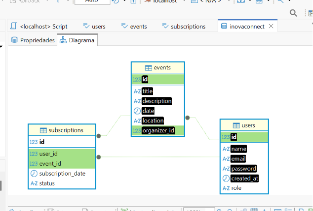
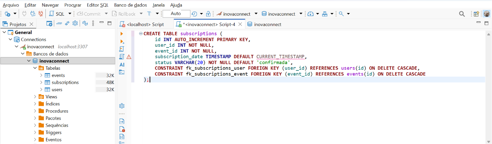
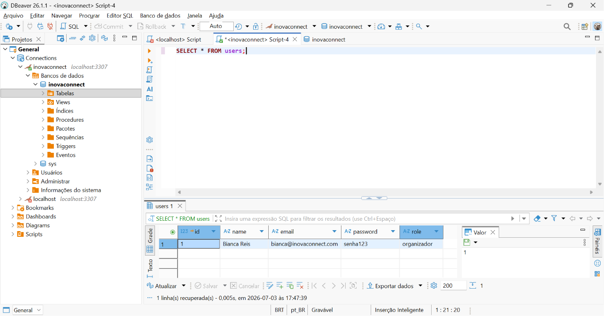
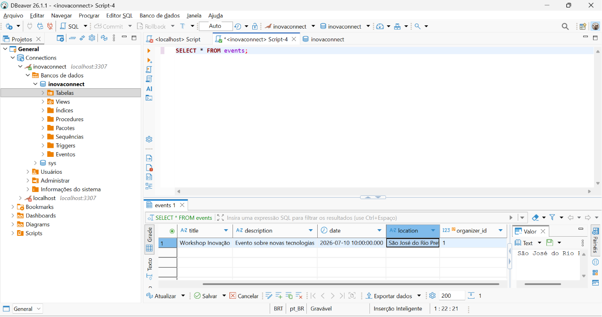

# InovaConnect - Sistema de Gerenciamento de Eventos

Este projeto foi desenvolvido por Bianca C. dos Reis como parte do processo seletivo para estágio Fullstack.

## 📋 Descrição do Projeto
O InovaConnect é uma plataforma focada em networking e gestão de eventos de inovação. O sistema permite a distinção de perfis (Organizador e Participante), garantindo controle sobre a criação de eventos e inscrições.

## 🚀 Tecnologias Utilizadas

### Backend
- **Linguagem:** Node.js com TypeScript
- **ORM:** [JVNOORM]
- **Banco de Dados:** MariaDB
- **Validação:** Zod
- **Autenticação:** JWT (JSON Web Token)
- **Contêinerização:** Docker

### Frontend
- **Framework:** React com Vite e TypeScript
- **Estilização:** Tailwind CSS
- **Gerenciamento de Estado:** React Hooks (Context API)

## 🛠️ Instruções de Execução

1. Clone o repositório:
   `git clone <seu-link-aqui>`
2. Configure as variáveis de ambiente (.env) baseadas no `.env.example`.
3. Suba o ambiente com Docker:
   `docker-compose up -d`
4. Instale as dependências e rode o servidor:
   `npm install && npm run dev`

## 🏗️ Decisões Técnicas e Arquiteturais
- **Modularidade:** Aplicação dos princípios SOLID, separando Controllers, Services e Rotas para facilitar a manutenção.
- **Segurança:** Implementação de JWT via interceptores no Axios para garantir que apenas rotas autorizadas sejam acessadas.
- **UX/UI:** Uso de Layout Wrappers e Custom Hooks para isolar a lógica de negócio do Frontend.

## 📸 Estrutura do Banco de Dados

### Diagrama de Relacionamento

### Processo de Criação (SQL)

### Verificação de Dados

---

*Nota: Versão do JVNOORM utilizada: 0.1.0*
